## Домашнее задание к занятию 5. «Практическое применение Docker»  

### Задача 0  
2. Установлен Docker Compose version v2.29.6
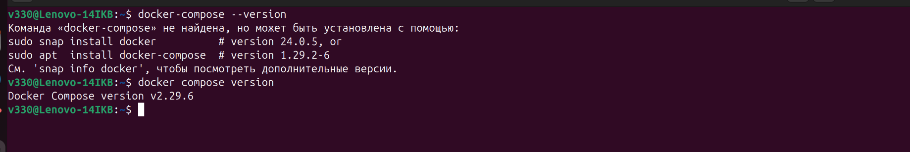  

***
### Задача 1  
1.
fork репозитория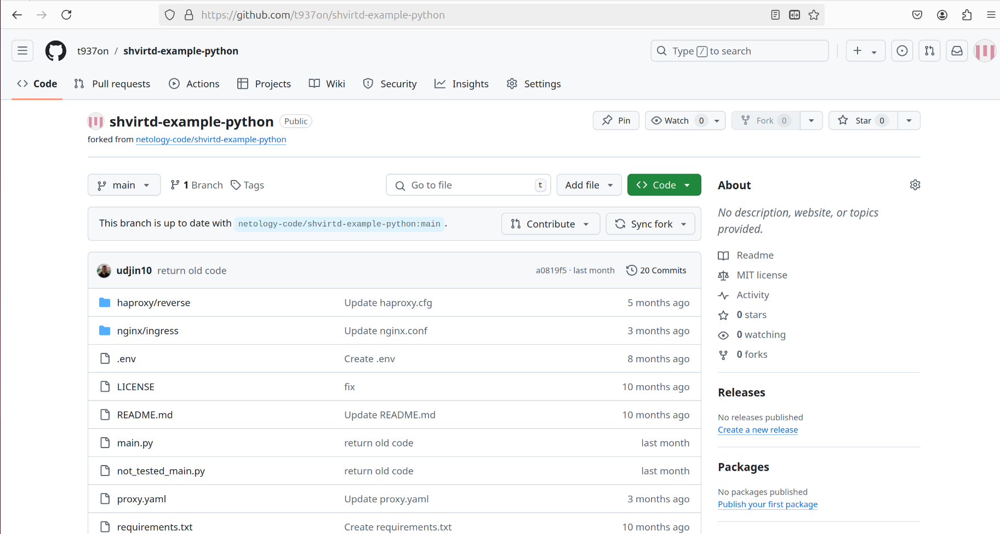  

2.
Файл с именем [Dockerfile.python](1/Dockerfile.python) для сборки данного проекта в Задаче 3  

***
### Задача 3  
4.
Скриншот sql-запроса проекта локально  
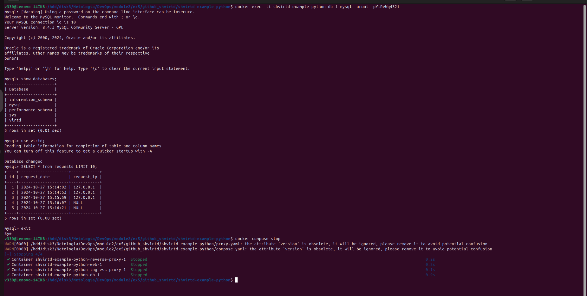  

Файлы и скриншоты по задаче можно посмотреть [здесь](3/)  

***
### Задача 4  
6.
Скриншот sql-запроса с Yandex Cloud ВМ  
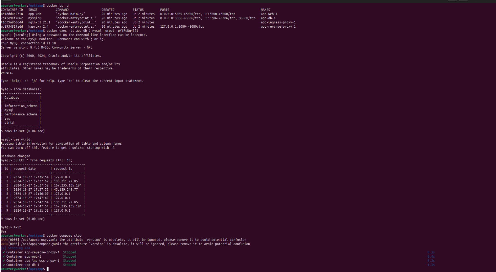  

bash-скрипт "project.sh" можно посмотреть [здесь](4/project.sh)  

Ссылка на fork-репозиторий:  [https://github.com/t937on/shvirtd-example-python/](https://github.com/t937on/shvirtd-example-python/)  

Файлы и скриншоты по задаче можно посмотреть [здесь](4/)  

***
### Задача 6  
Скриншоты действий с Yandex Cloud ВМ:  
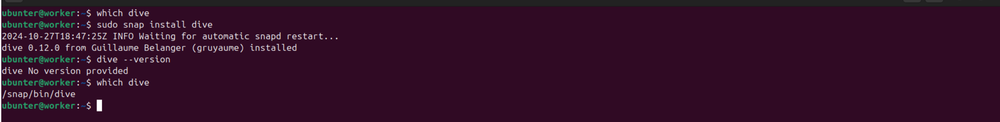  

  

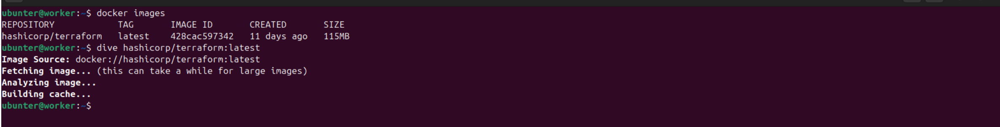  

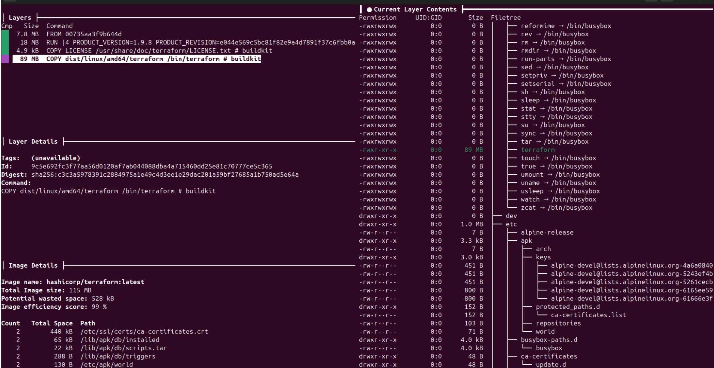  

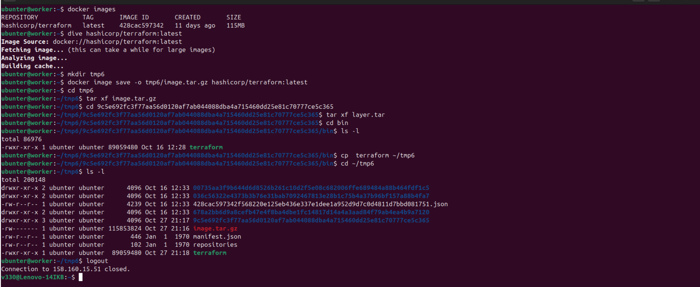  

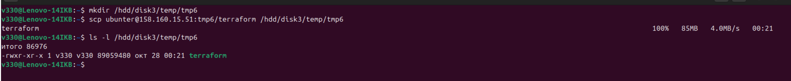  

***
### Задача 6.1  
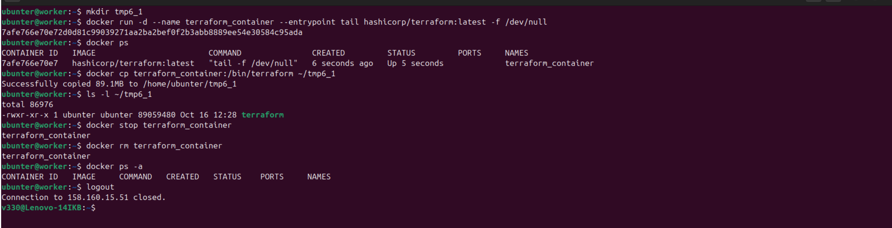  

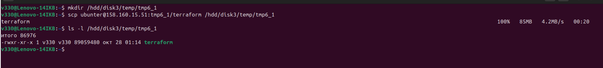  

Файлы и скриншоты по задаче можно посмотреть [здесь](6/)  

